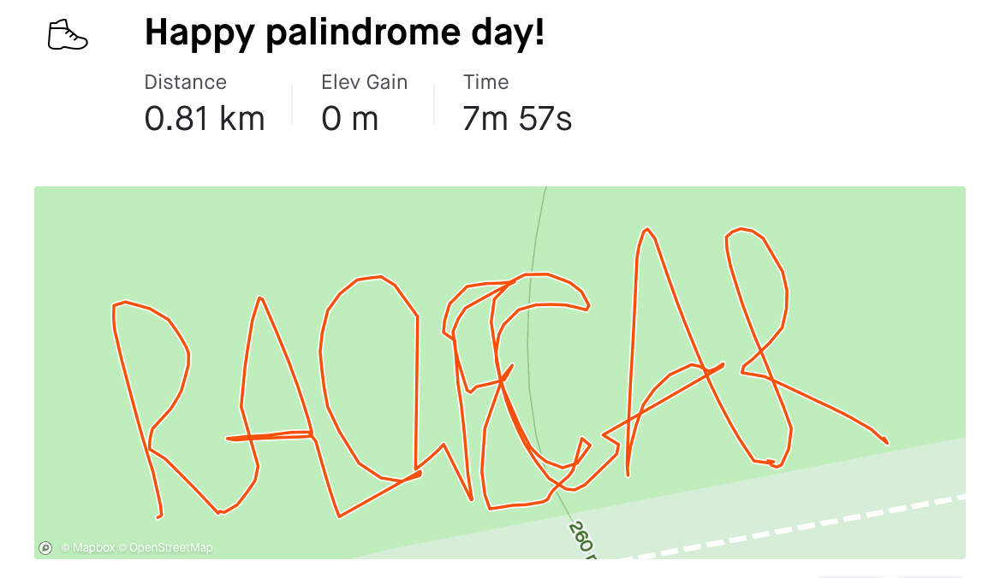
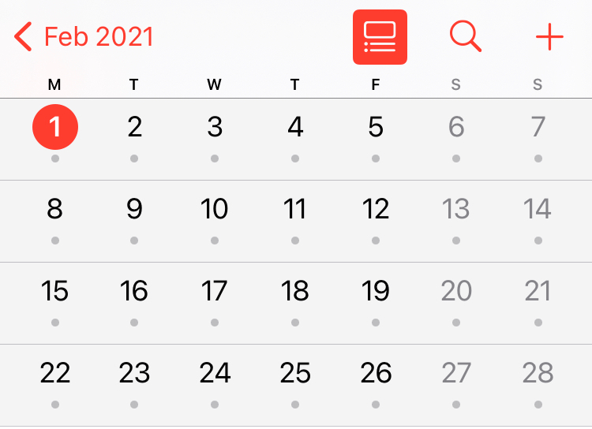

# This event has been completed!
If you'd like to read about it the details are below.

27 people were kind enough to humour me and take part.

The most impressive Strava activity we received was this one.

# 12th of February 2021 is a Palindrome Day!
Palindrome dates in the UK are pretty rare because of the date format we use. In fact until recently the last palindrome date we had was on the 11th of November in the year 1111! For date geeks, note I am using the date format DD-MM-YYYY. This is the little-endian format, the official long date format used by the United Nations for printed documentation, but not ISO 8601 compatible.

Anyway, last year a cool thing happened, on the 2nd of Feb we had our first palindrome date in over 900 years - 02.02.2020.

In 2021 we have a second palindrome date: 12.02.2021.

This is also an ambigram, which means the date reads the same from left to right as it does from right to left and also upside down!

## How many people are taking part?

Oh this is an exclusive event, highly exclusive. In fact, apart from me I think one other person may participate. Between you and me though I think they might be humouring me...

## Is there anything else special about this February?

Why yes there is! Every six to ten years we get a rectangular February, which is where the first day of February, a month with 28 days, falls on a Monday (the first day of the week according to ISO 8601).

## Tell me about the medal
Each one is hand made; 3D printed with hand sewn ribbon.

They are 60mm wide x 100mm tall and made from the finest Polylactic Acid (PLA, a plastic). They are attached to 80cm of 38mm wide red satin ribbon.

It's inspired by the Sator Square, a two dimensional, five word Latin palindrome with four symmetries. It bears an inscription of the event name and date.

