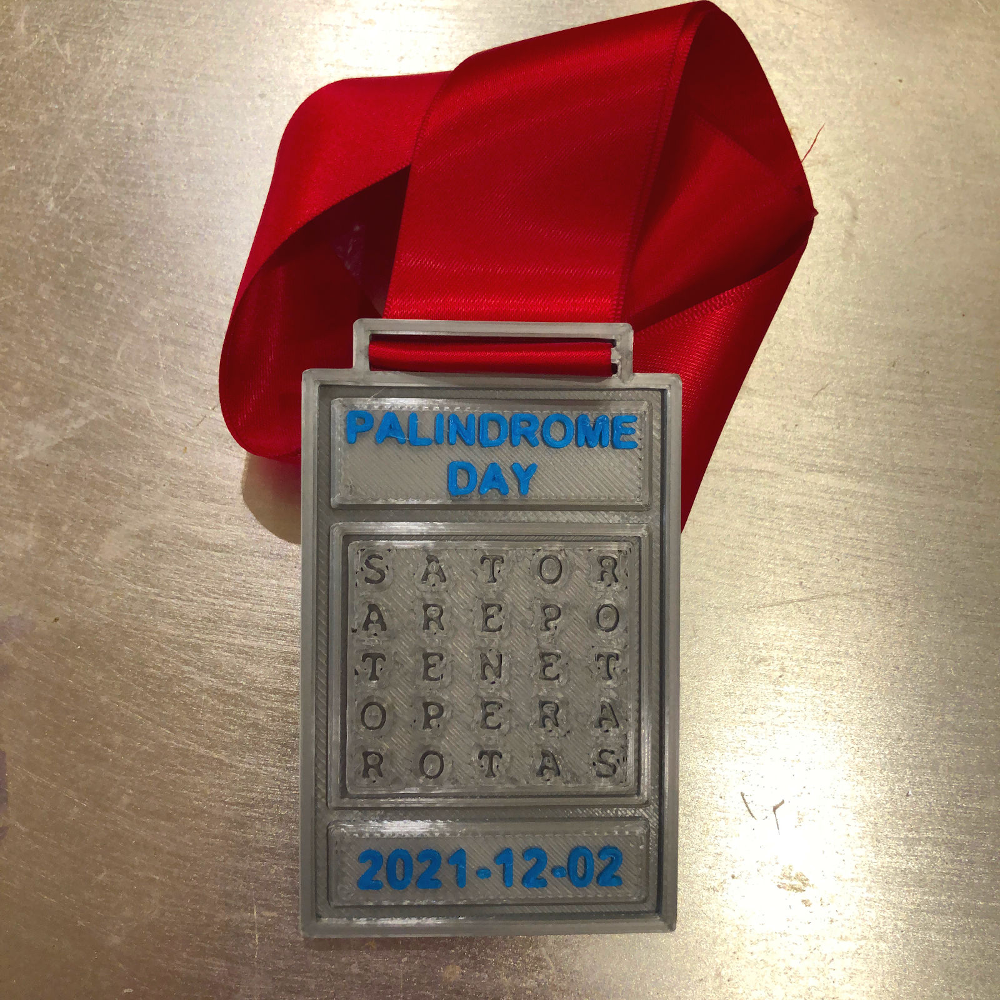

# This event has been completed!
If you'd like to read about it the details are below.

15 people were kind enough to humour me and take part.

# What's this event then?
A palindrome is a series of numbers or letters that reads the same from right to left as it does from left to right, e.g. racecar.

A Palindrome Day is any date in the calendar where the numbers read the same left to right and right to left.

After the last event on [12.02.2021](12.02.2021) we received many understandable complaints from Palindrome appreciators who recognise only [ISO 8601](https://en.wikipedia.org/wiki/ISO_8601) compatible dates.

Therefore we have decided to run a second event on 2021-12-02 which is fully ISO 8601 compliant (including the delimiters).

Run, Cycle, Walk, cover a distance, and you can earn an exclusive Palindrome-themed medal!

## Why are you doing this event?

Well, we love palindromes.

The bigger reason is that we believe exercise is good for our mental wellbeing.

This last year has been singularly rubbish for everyone, everywhere in the world, regardless of how rubbish our lives are ordinarily. It has often been difficult or impossible to exercise, so just when we need it, we can't do it. Once we get out of an exercise routine it is often hard to get back on it. Motivation has been in short supply.

So, this event is a celebration of a palindrome date, or it is a thinly veiled excuse to do some exercise and earn a medal.

Personally, we've used the promise of shiny medals to get our kids outdoors to exercise too.

## How many people are taking part?

Based on the last event, I think as many as tens of people who thought it was amusing and overlooked the questionable quality of the medals.

## Tell me about the medal
Each one is 3D printed. They are 60mm wide x 100mm tall and made from the finest Polylactic Acid (PLA, a plastic). They are attached to 80cm of 38mm wide red satin ribbon.

It's inspired by the Sator Square, a two dimensional, five word Latin palindrome with four symmetries. It bears an inscription of the event name and date.

