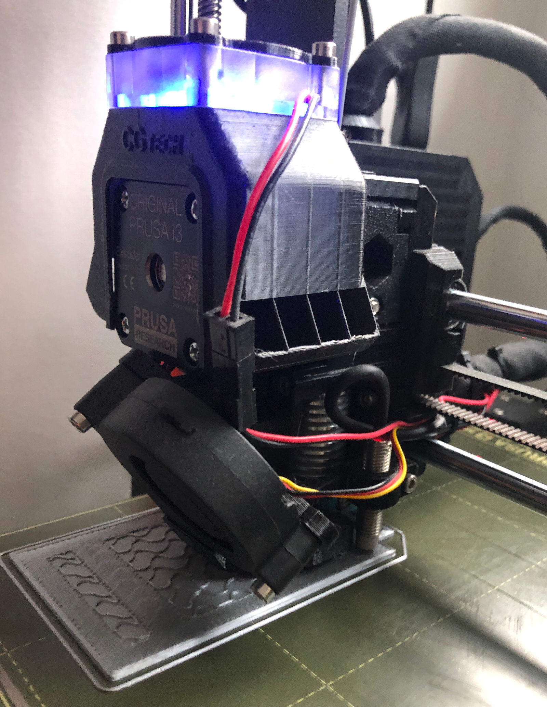

# Tell me about the medal

Oh, they are beautiful. Exclusively designed by me and I am highly unqualified to design anything.

Each one is hand made. Seriously! I will be 3D printing them and then hand sewing the ribbon on.

They are 60mm wide x 100mm tall and made from the finest Polylactic Acid (PLA, a plastic, I don't own a metal printer). They are attached to 80cm of 38mm wide red satin ribbon.

It's inspired by the Sator Square, a two dimensional, five word Latin palindrome with four symmetries. It bears an inscription of the event name and date.
